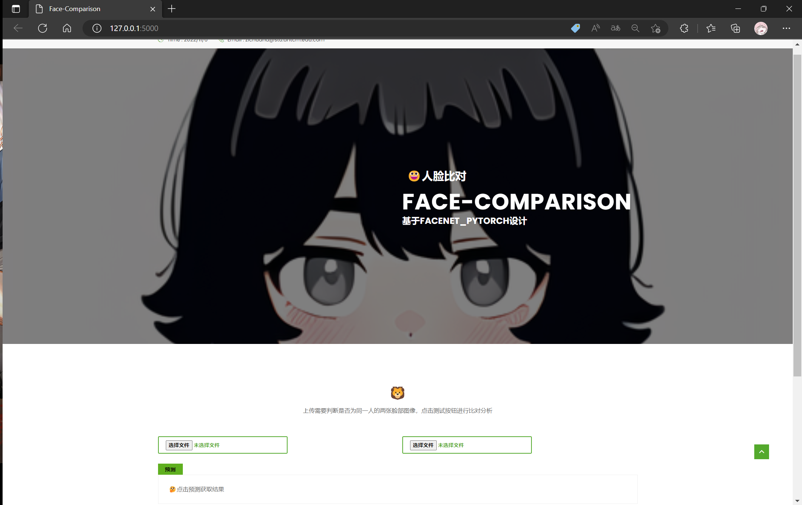

### 基于facenet_pytorch设计
主页面  

样例检测结果如下(图片来自于百度图库)  

### python 3.10
### 所用到的库及其版本
```
Flask                        2.2.1
opencv-python                4.6.0.66
torch                        1.12.1
facenet-pytorch              2.5.2
```
### 教程
[我的博客](https://zichuana.github.io/2022/11/20/Face-Comparison-Demo/)
